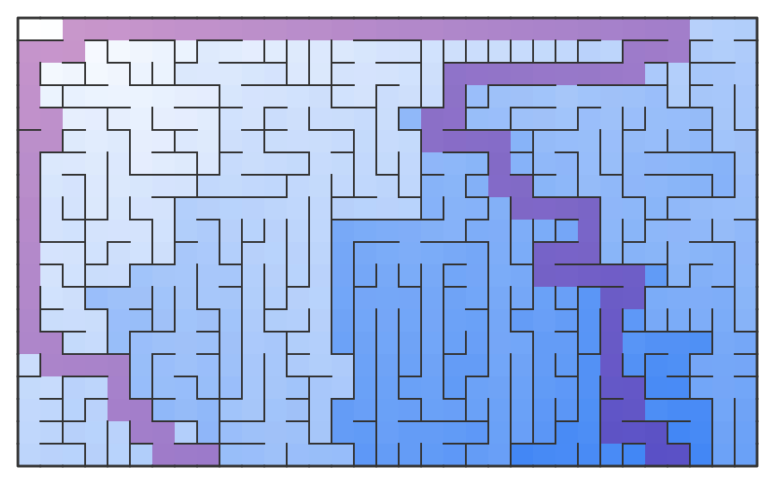
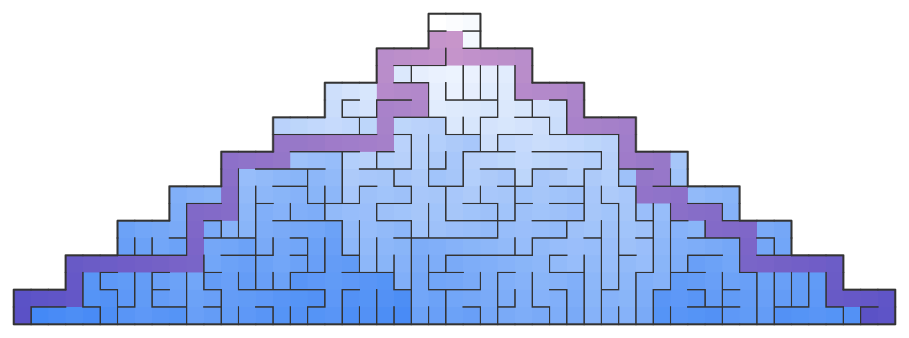
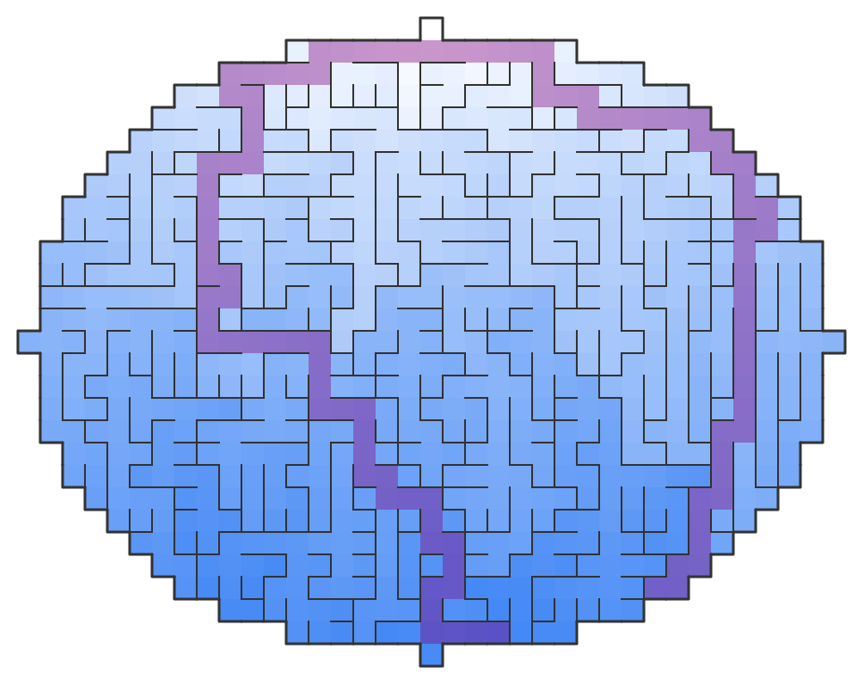
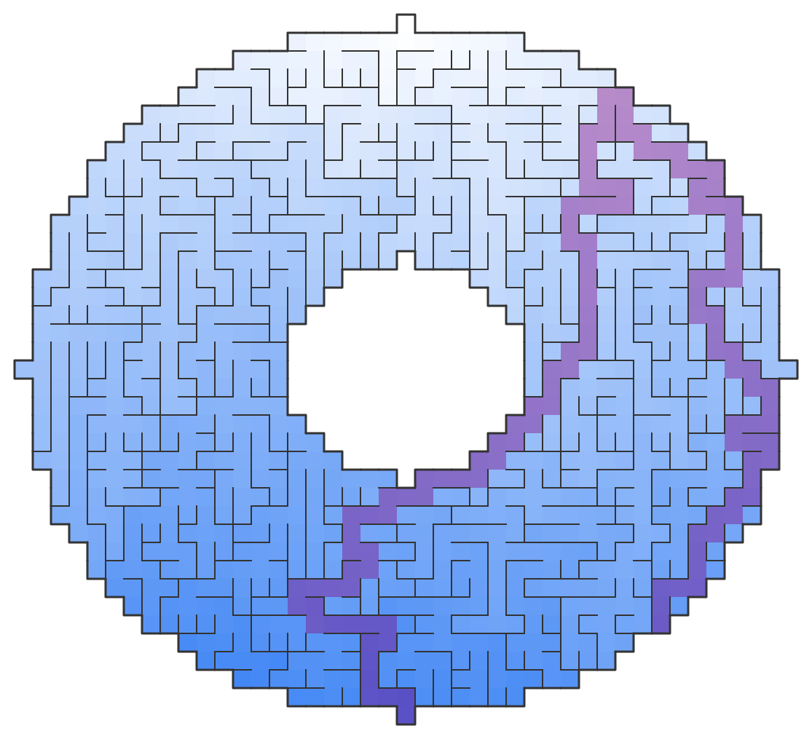
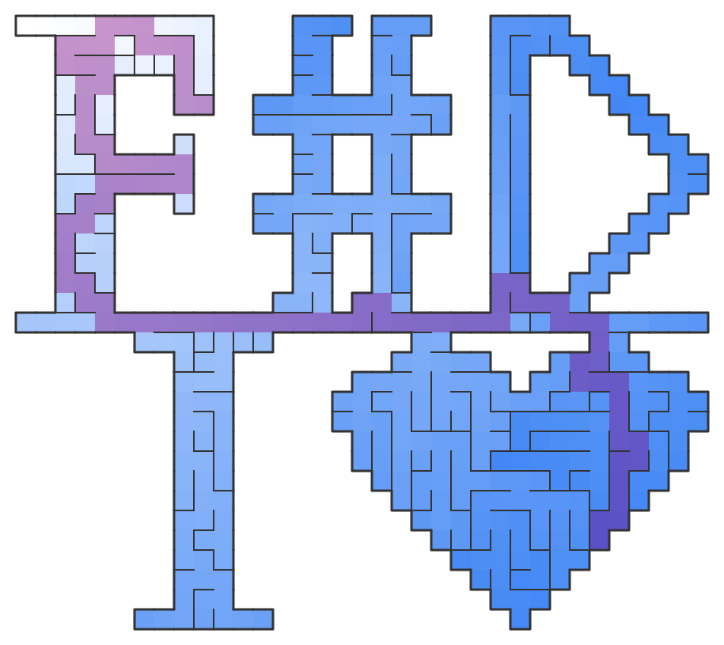

# F-a-maze-ing
A, simple, composable and configurable maze generator made with F#

## Examples

### SVG
The SVG render can color the maze and show the path(s) between two zones that are the most distant :
* Rectangular



* Triangular



* Ellipse



* Doughnut



* Composite



### ASCII
The text render is simpler and only displays the maze (using the Unicode characters [link](https://en.wikipedia.org/wiki/Box-drawing_character)) :
<div style="font-family: 'DejaVu Sans Mono', monospace">
    <pre class="maze-line">                ┏━┓            
          ┏━┯━━━┛ ┗━━━━━┓      
      ┏━━━┩ ┴ ╭─┬───────╄━━━┓  
      ┃ ┬ ┴ ╶─╯ │ ╶───╮ ╰─╴ ┃  
    ┏━┛ ╰─┬───┲━┷━━━┓ ├───╮ ┗━┓
    ┗━┓ ╶─╯ ┬ ┗━━━━━┩ │ ┬ ├─┲━┛
      ┃ ╶─╮ ╰─┬─╴ ╭─╯ │ │ ┴ ┃  
      ┗━━━╅─╴ │ ╶─╯ ┬ ┴ ┢━━━┛  
          ┗━━━┷━┓ ┏━┷━━━┛      
                ┗━┛            </pre>
</div>

## Usage
###### (more to come) 
```
mazes

  -n, --name         A name for the maze. If empty, a default one is provided.

  -r, --rows         (Default: 50) The number of rows of the maze.

  -c, --columns      (Default: 80) The number of columns of the maze.

  -a, --algo         The algorithm to use to generate the maze. If empty, a random one is chosen.
                     Options are :
                     - BinaryTree
                     - Sidewinder
                     - AldousBroder
                     - Wilson
                     - HuntAndKill

  -s, --seed         The seed number to use for the random number generator. If empty, a random seed is picked.

  -d, --directory    The directory where to output the maze. If empty, the directory of the program is used.

  -q, --quiet        (Default: false) Automatically exit the program when finished

  --help             Display this help screen.

  --version          Display version information.
```