

# F-a-maze-ing
An easy-to-use, composable and configurable maze generator and solver. Several types of grid tiles with multiple possible shapes.

## Usage
You may visit https://mazes.apixelinspace.com to randomly generate a few examples (website in preview version, work in progress)

Documentation for the CLI is coming soon.

## Examples

### Orthogonal maze

With squares


With circles


With a 'hand-drawn feel'


With a shape from an image


### Penta maze

With the "Cairo" pentagonal tiling


### Theta maze

### Sigma maze


### Delta maze


### Upsilon maze


### Brick maze


### Customizable shapes





### ASCII
The text render is simpler and only displays orthogonal mazes (using the Unicode characters [link](https://en.wikipedia.org/wiki/Box-drawing_character)) :

    <pre class="maze-line">                ┏━┓            
          ┏━┯━━━┛ ┗━━━━━┓      
      ┏━━━┩ ┴ ╭─┬───────╄━━━┓  
      ┃ ┬ ┴ ╶─╯ │ ╶───╮ ╰─╴ ┃  
    ┏━┛ ╰─┬───┲━┷━━━┓ ├───╮ ┗━┓
    ┗━┓ ╶─╯ ┬ ┗━━━━━┩ │ ┬ ├─┲━┛
      ┃ ╶─╮ ╰─┬─╴ ╭─╯ │ │ ┴ ┃  
      ┗━━━╅─╴ │ ╶─╯ ┬ ┴ ┢━━━┛  
          ┗━━━┷━┓ ┏━┷━━━┛      
                ┗━┛            </pre>

## Book

This project is inspired by working through the book [Mazes for Programmers](https://pragprog.com/book/jbmaze/mazes-for-programmers) by Jamis Buck.

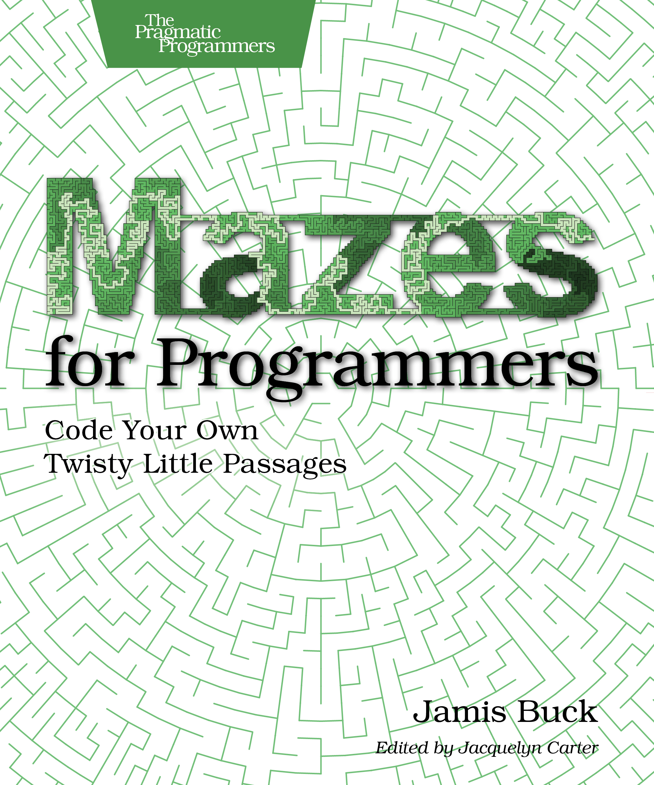

The code in the book is written in Ruby and leans on Object-Oriented design.

My goal is two fold : give the project a functional spin and learn F# in the process. To do so, I freely change or adapt much of the original code and implementation.