#  F-a-maze-ing

An easy-to-use, composable and configurable maze generator and solver. Several types of grid tiles with multiple possible shapes.

## :zap: Usage

[Use the Command Line Interface](https://github.com/aPixelInSpace/F-a-maze-ing/wiki#usage)

Alternatively, you may visit https://mazes.apixelinspace.com to randomly generate a few examples (website in preview version, work in progress)

## :wrench: Build

[Build the project from the source code](https://github.com/aPixelInSpace/F-a-maze-ing/wiki#build)

## :tada: Examples

## :book: Book

This project is inspired by working through the book [Mazes for Programmers](https://pragprog.com/book/jbmaze/mazes-for-programmers) by Jamis Buck.

The code in the book is written in Ruby and leans on Object-Oriented design.

My goal is two fold : give the project a functional spin and learn F# in the process. To do so, I freely change or adapt much of the original code and implementation.